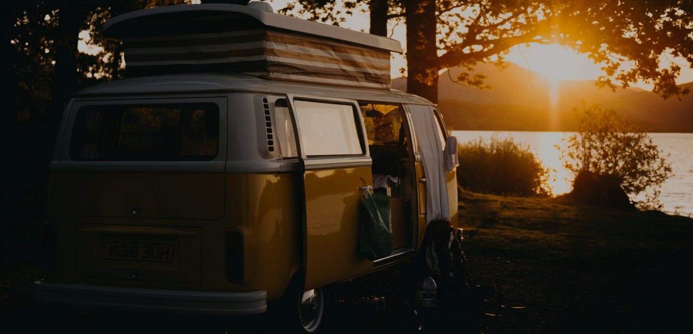

# CampersDreams Application



## About CampersDreams

CampersDreams is your premier destination for camper van and RV rentals. We specialize in providing high-quality, well-maintained recreational vehicles that turn your travel dreams into reality. Whether you're planning a weekend getaway or a cross-country adventure, our diverse fleet of campers offers the perfect blend of comfort and mobility.

### Why Choose CampersDreams?

- **Diverse Fleet**: From compact vans to luxury RVs, find the perfect vehicle for your journey
- **Quality Assured**: All vehicles undergo rigorous maintenance checks
- **Flexible Rental Options**: Choose rental periods that suit your travel plans
- **Full Equipment**: Vehicles come with essential amenities for a comfortable journey
- **24/7 Support**: Customer support throughout your rental period
- **Convenient Locations**: Multiple pickup and drop-off points for your convenience

## Features

- 🚐 Browse through our extensive catalog of campers
- 🔍 Advanced filtering options (location, vehicle type, amenities)
- ⭐ Save your favorite vehicles
- 📱 Responsive design for all devices
- 📝 Easy booking process
- 💬 Review system with ratings
- 📍 Location-based search

## Technologies Used

- React 18
- Vite
- Redux Toolkit for state management
- React Router for navigation
- Axios for API requests
- CSS Modules for styling

## Getting Started

### Prerequisites

Before you begin, ensure you have the following installed:

- Node.js (version 14.0 or higher)
- npm (usually comes with Node.js)

### Installation

1. Clone the repository:

```bash
git clone https://github.com/sergiy-ka/campers-dreams.git
```

2. Navigate to the project directory:

```bash
cd campers-dreams
```

3. Install dependencies:

```bash
npm install
```

4. Start the development server:

```bash
npm run dev
```

The application will open in your default browser at `http://localhost:5173`

### Building for Production

To create a production build:

```bash
npm run build
```

To preview the production build:

```bash
npm run preview
```

## Project Structure

```
src/
  ├── components/    # Reusable components
  ├── pages/         # Page components
  ├── redux/         # Redux store configuration
  ├── services/      # API services
  ├── hooks/         # Custom hooks
  ├── constants/     # Constants and configuration
  ├── utils/         # Utility functions
  └── assets/        # Static assets
```

## API Integration

The application uses a REST API available at:

```
https://66b1f8e71ca8ad33d4f5f63e.mockapi.io/campers
```

## Contributing

1. Fork the repository
2. Create your feature branch (`git checkout -b feature/AmazingFeature`)
3. Commit your changes (`git commit -m 'Add some AmazingFeature'`)
4. Push to the branch (`git push origin feature/AmazingFeature`)
5. Open a Pull Request

## License

This project is licensed under the MIT License - see the [LICENSE.md](LICENSE.md) file for details

## Contact

Project Link: [https://github.com/sergiy-ka/campers-dreams](https://github.com/sergiy-ka/campers-dreams)
